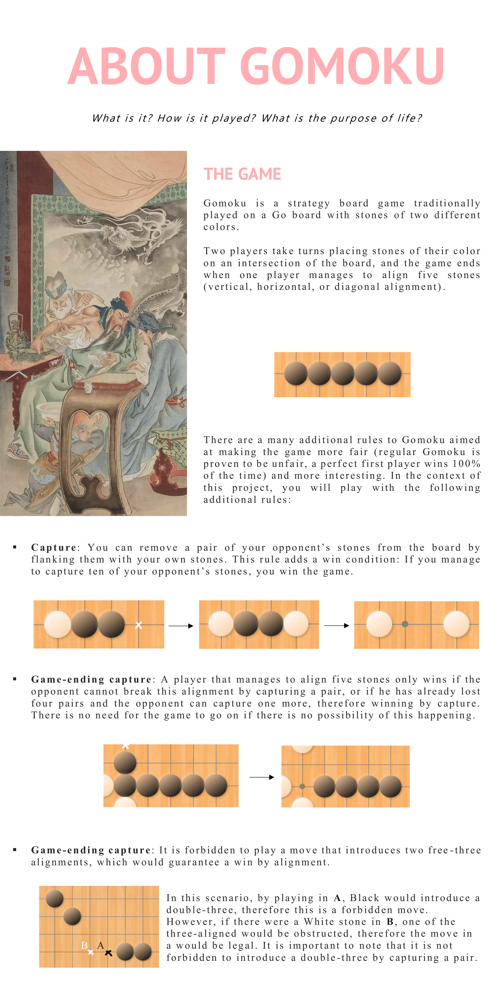

# GOMOKU

#### *Welcome to our project repository. Gomoku is a strategy board played on a Go board with stones of two different colors. You can play with a friend, or against our AI, but you might never beat it because it is so awesome* :smile: </br>

You'll find more details below in this readme, or directly on our webpage: http://gomoku.deyaberger.fr

## Prerequisites
node v16.13.0 </br>
npm 8.1.0</br>
boost</br>
g++ -10</br>
cmake</br>

## Usage:
open this git foler in two terminals
in one of them, go in the algo folder and do :
```bash
cd algo
./Gomook_Single_Fred
```
If you have a very powerful computer, you can also launch instead
```bash
./Gomook_Multi_Fred
```
If you want to recompile these binaries, you'll have to do the followings:
```bash
cd algo
mkdir build
cd build
cmake ..
cmake --build .
```
and then launch the server from the build repository

while this server part is launched, in the other terminal, main folder of this repository, do the following:
```bash
npm i && npm start
```

